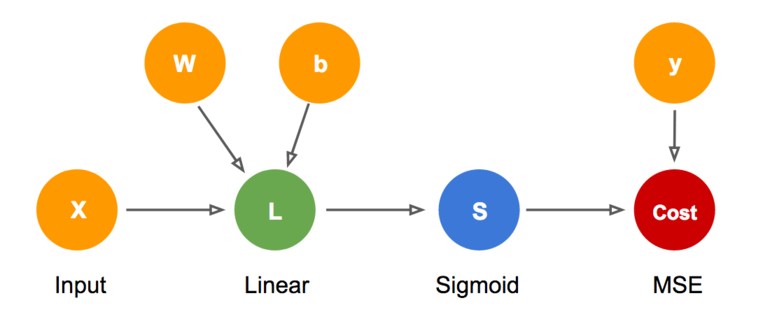

# Miniflow  

Miniflow creates a small neural networks using NumPy for learning the fundamental abstract of TensorFlow.  
This is the contents of [Deep Learning nanodegree foundation](https://www.udacity.com/course/deep-learning-nanodegree-foundation--nd101) in Udacity.  
  
## Architecture
It uses a Python class to represent a generic node in miniflow.py 
And use Input, Linear, Sigmoid and MSE which are subclasses of Node.  
They have forward and backward steps.  

The topological_sort() function implements topological sorting using Kahn's Algorithm.   

## Simple neural networks


  
I train the network to use the Boston Housing dataset in boston_nn.py It is in the sklearn.datasets.
You can see that loss decreases as epoch increases. 
```shell
Epoch: 10, Loss: 11.437, Accuracy: 59.000
Epoch: 20, Loss: 10.335, Accuracy: 61.000
Epoch: 30, Loss: 7.920, Accuracy: 59.000
Epoch: 40, Loss: 8.254, Accuracy: 58.200
Epoch: 50, Loss: 7.278, Accuracy: 60.800
Epoch: 60, Loss: 8.962, Accuracy: 64.000
Epoch: 70, Loss: 6.686, Accuracy: 60.600
Epoch: 80, Loss: 6.665, Accuracy: 59.800
Epoch: 90, Loss: 6.125, Accuracy: 62.600
Epoch: 100, Loss: 6.556, Accuracy: 58.200
```
You can change epochs, learning_rate and batch_size to decrease loss more fast.
Check the file.

